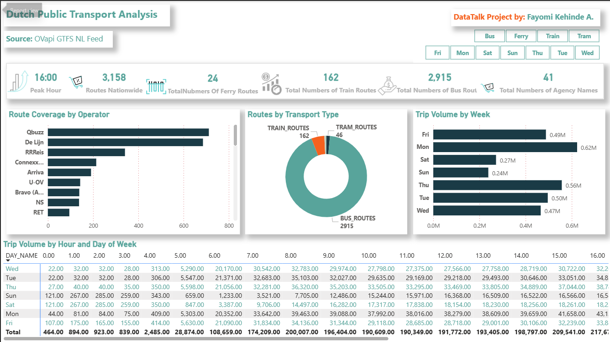
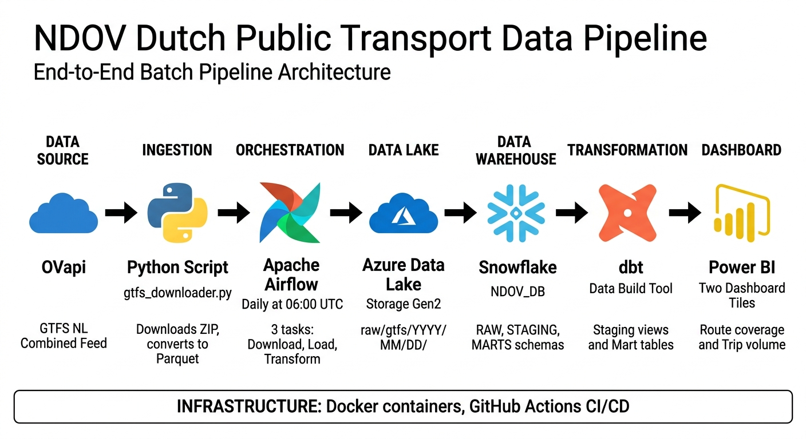

# NDOV Dutch Public Transport Pipeline

## What is NDOV?
NDOV stands for Nationale Data Openbaar Vervoer (National Data Public Transport).
It is the Dutch national access point for public transport data, operated by the
national data broker for public transport in the Netherlands. All Dutch transport
operators publish their schedule data through this platform.

## Project Overview
This project builds an end-to-end batch data pipeline that ingests Dutch public
transport schedule data in GTFS (General Transit Feed Specification) format,
processes it through a modern data stack, and visualises it in an interactive
Power BI dashboard.

The pipeline runs automatically every day at 06:00 UTC and covers all Dutch
public transport operators including NS (Nederlandse Spoorwegen), GVB
(Gemeentelijk Vervoerbedrijf Amsterdam), RET (Rotterdamsche Elektrische Tram),
HTM (Haagsche Tramweg Maatschappij), Arriva, Connexxion, Qbuzz and 35 others.

## Dashboard Preview



The dashboard provides two interactive tiles:
- **Tile 1:** Route coverage by operator across the Netherlands,
  filterable by transport type (Bus, Train, Tram, Ferry)
- **Tile 2:** Trip volume heatmap showing when the Dutch public
  transport network is busiest by hour and day of week

  ## Pipeline Architecture



## Problem Statement
Build a dashboard with two tiles that answer the following questions:
1. Which Dutch public transport operators cover the most routes and what types
   of transport do they operate?
2. When is the Dutch public transport network busiest during the week?

## Dashboard
The Power BI dashboard contains:
- Tile 1: Route coverage by operator filterable by transport type
  (Bus, Train, Tram, Ferry)
- Tile 2: Trip volume heatmap by hour and day of week
- KPI Cards: Total routes, total operators, train routes, bus routes, peak hour
- Slicer: Filter all visuals by transport type

## Data Source
- Provider: OVapi (Open Transport Data API)
- Feed: GTFS NL combined feed (alle operators gecombineerd)
- URL: https://gtfs.ovapi.nl/nl/gtfs-nl.zip
- Format: GTFS (General Transit Feed Specification), an open international
  standard for public transport schedules
- Coverage: All Dutch public transport operators
- Update frequency: Daily

## Architecture

### Data Flow

OVapi (gtfs-nl.zip)
    Python ingestion script
    Azure Data Lake Storage Gen2 (raw Parquet files)
    Snowflake RAW tables (loaded by Airflow)
    dbt staging models (clean and type)
    dbt mart models (aggregate)
    Power BI Dashboard

    ### Technology Stack

| Layer          | Tool                         | Description                                    |
|----------------|------------------------------|------------------------------------------------|
| Ingestion      | Python + requests            | Downloads GTFS ZIP and converts to Parquet     |
| Data Lake      | Azure Data Lake Storage Gen2 | Stores raw Parquet files partitioned by date   |
| Orchestration  | Apache Airflow               | Schedules and monitors the daily pipeline      |
| Data Warehouse | Snowflake                    | Stores and queries transformed data            |
| Transformation | dbt (Snowflake adapter)      | Cleans, types and aggregates the raw data      |
| Dashboard      | Power BI                     | Visualises the final mart tables               |
| CI/CD          | GitHub Actions               | Lints and validates code on every push         |
| Containers     | Docker                       | Runs Airflow locally in a reproducible environment |

## Airflow DAG
The DAG named gtfs_ingestion runs three tasks in sequence every day at 06:00 UTC:

download_and_upload_gtfs >> load_parquet_to_snowflake >> run_dbt_models

- Task 1 (download_and_upload_gtfs): Downloads the GTFS ZIP from OVapi,
  extracts each file, converts to Parquet format and uploads to Azure Data Lake.
  Skips the download if today's files already exist to avoid rate limiting.
- Task 2 (load_parquet_to_snowflake): Truncates and reloads all raw Snowflake
  tables from the Azure external stage using COPY INTO commands.
- Task 3 (run_dbt_models): Runs all dbt models to refresh staging views and
  mart tables in Snowflake.

## Snowflake Database Structure

NDOV_DB/
RAW/                       Raw data loaded directly from Azure
raw_agency                 Transport operators (41 rows)
raw_routes                 All routes (3,159 rows)
raw_stops                  All stops and stations (70,368 rows)
raw_trips                  All scheduled trips (872,336 rows)
raw_stop_times             All arrival and departure times (16,957,887 rows)
raw_calendar_dates         Service calendar exceptions (319,939 rows)
raw_feed_info              Feed metadata (1 row)
STAGING/                   Cleaned and typed dbt views
stg_agency
stg_routes
stg_stops
stg_trips
stg_stop_times
stg_calendar_dates
MARTS/                      Aggregated tables for dashboard consumption
mart_route_coverage         Routes per operator by type (41 rows)
mart_trip_volume_by_hour    Trip volume by hour and day (168 rows)

## Project Folder Structure

```
ndov-transit-pipeline/
│
├── airflow/
│   ├── dags/
│   │   ├── gtfs_ingestion_dag.py     # Orchestrates data pipeline tasks
│   │   └── snowflake_load.py         # Loads data into Snowflake
│   └── plugins/                      # Custom Airflow extensions
│
├── dbt/
│   ├── dbt_packages/                 # Installed dbt dependencies
│   ├── logs/                         # dbt run logs
│   ├── macros/
│   │   └── generate_schema_name.sql  # Custom schema logic
│   ├── models/
│   │   ├── marts/
│   │   │   ├── mart_route_coverage.sql
│   │   │   └── mart_trip_volume_by_hour.sql
│   │   └── staging/
│   │       ├── sources.yml
│   │       ├── stg_agency.sql
│   │       ├── stg_calendar_dates.sql
│   │       ├── stg_routes.sql
│   │       ├── stg_stop_times.sql
│   │       ├── stg_stops.sql
│   │       └── stg_trips.sql
│   ├── target/
│   └── dbt_project.yml
│
├── ingestion/
│   └── gtfs_downloader.py
│
├── docker/
│   └── airflow/
│       └── Dockerfile
│
├── dashboard/
│   └── ndov_dashboard.pbix
│
├── docs/
│   └── architecture.md
│
├── .github/
│   └── workflows/
│       └── ci.yml
│
├── .env.example
├── .gitignore
├── docker-compose.yml
├── requirements.txt
└── README.md
```

## Glossary

| Term    | Full Meaning                                      |
|---------|---------------------------------------------------|
| NDOV    | Nationale Data Openbaar Vervoer                   |
| GTFS    | General Transit Feed Specification                |
| OVapi   | Open Transport Data API                           |
| NS      | Nederlandse Spoorwegen (Dutch Railways)           |
| GVB     | Gemeentelijk Vervoerbedrijf Amsterdam             |
| RET     | Rotterdamsche Elektrische Tram                    |
| HTM     | Haagsche Tramweg Maatschappij                     |
| DAG     | Directed Acyclic Graph (Airflow pipeline definition) |
| dbt     | Data Build Tool                                   |
| CI/CD   | Continuous Integration / Continuous Deployment    |
| KPI     | Key Performance Indicator                         |
| ADLS    | Azure Data Lake Storage                           |
| ETL     | Extract Transform Load                            |
| ELT     | Extract Load Transform (our approach)             |

## Setup Instructions

### Prerequisites
- Docker Desktop installed and running
- Python 3.11 or higher
- Snowflake account (free trial available)
- Azure account with Data Lake Storage Gen2
- Power BI Desktop (free download)

### Local Setup

1. Clone the repository:
```bash
git clone https://github.com/YOUR_USERNAME/ndov-transit-pipeline.git
cd ndov-transit-pipeline
```

2. Copy the environment template and fill in your credentials:
```bash
cp .env.example .env
```

3. Build and start Airflow:
```bash
docker compose up airflow-init
docker compose up -d
```

4. Open Airflow at http://localhost:8080
   - Username: admin
   - Password: admin

5. Enable and trigger the gtfs_ingestion DAG

6. Configure dbt by creating ~/.dbt/profiles.yml with your Snowflake credentials

7.  Snowflake setup SQL file: 
-- Run this entire script in a Snowflake worksheet as ACCOUNTADMIN

USE ROLE ACCOUNTADMIN;

CREATE WAREHOUSE IF NOT EXISTS NDOV_WH
    - WAREHOUSE_SIZE = 'X-SMALL'
    - AUTO_SUSPEND = 60
    - AUTO_RESUME = TRUE
    - INITIALLY_SUSPENDED = TRUE;

CREATE DATABASE IF NOT EXISTS NDOV_DB;

- CREATE SCHEMA IF NOT EXISTS NDOV_DB.RAW;
- CREATE SCHEMA IF NOT EXISTS NDOV_DB.STAGING;
- CREATE SCHEMA IF NOT EXISTS NDOV_DB.MARTS;

CREATE ROLE IF NOT EXISTS NDOV_ROLE;

- GRANT USAGE ON WAREHOUSE NDOV_WH TO ROLE NDOV_ROLE;
- GRANT ALL PRIVILEGES ON DATABASE NDOV_DB TO ROLE NDOV_ROLE;
- GRANT ALL PRIVILEGES ON SCHEMA NDOV_DB.RAW TO ROLE NDOV_ROLE;
- GRANT ALL PRIVILEGES ON SCHEMA NDOV_DB.STAGING TO ROLE NDOV_ROLE;
- GRANT ALL PRIVILEGES ON SCHEMA NDOV_DB.MARTS TO ROLE NDOV_ROLE;

GRANT ROLE NDOV_ROLE TO USER YOUR_SNOWFLAKE_USERNAME;

8. Open dashboard/ndov_dashboard.pbix in Power BI Desktop and refresh data

## CI/CD
Every push to main or pull request triggers GitHub Actions which:
- Lints Python files with flake8
- Validates Python syntax on ingestion scripts

## Author
Fayomi Kehinde Adeseun

Built as a capstone project for the DataTalks.Club Data Engineering Zoomcamp.